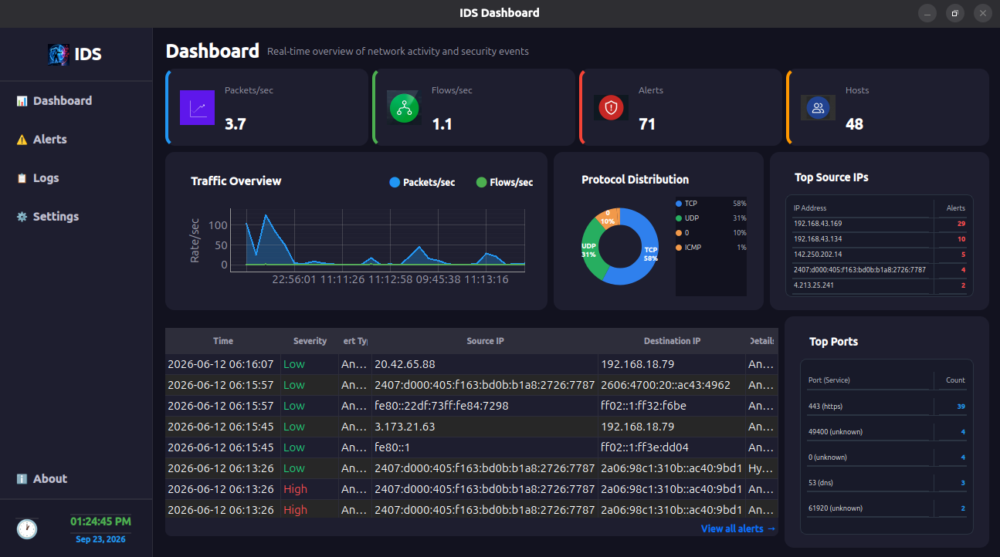
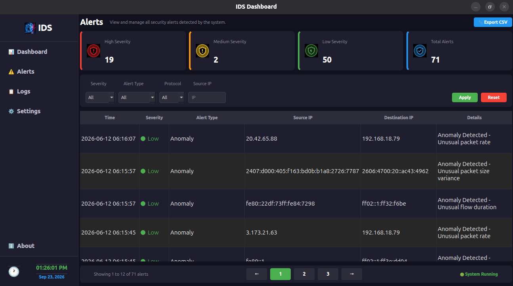
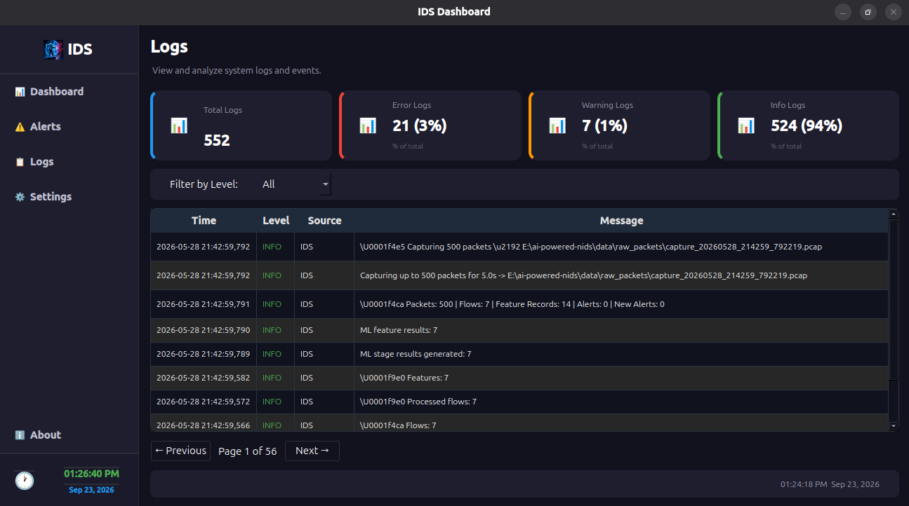
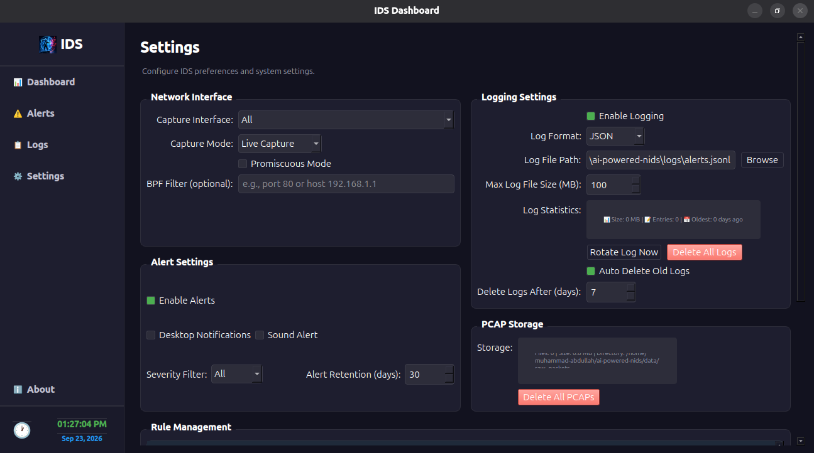

# AI-Powered Hybrid Network Intrusion Detection System

A desktop-based Hybrid Network Intrusion Detection System (NIDS) built as a Final Year Project to capture live network traffic, convert packets into flows, extract security-focused features, detect suspicious activity through signature rules, ML models, anomaly detection, and hybrid fusion, then present alerts through a modern PySide6 dashboard.

The project is designed as an end-to-end IDS workflow: packet capture, PCAP storage, parsing, flow construction, feature engineering, multi-engine detection, alert persistence, and desktop visualization.

## Highlights

- Live packet capture using `tshark`
- Automatic PCAP storage and cleanup policy
- Packet parsing for IPv4/IPv6, TCP, UDP, and ICMP-style traffic metadata
- Network flow building with packet, byte, direction, duration, and TCP flag statistics
- Rule/signature-based detection using active JSON rules from `rule/`
- CICIDS-style feature engineering for ML/anomaly workflows
- Two-stage ML pipeline for binary attack detection and attack-family classification
- Statistical and threshold-based anomaly detection engine
- Hybrid fusion engine that correlates signature + ML/anomaly alerts on the same flow
- Alert normalization, deduplication, SQLite persistence, and JSONL audit logging
- Desktop dashboard with packets/sec, flows/sec, timeline graph, alerts, and host stats
- Alerts screen with severity cards, filtering, pagination, and CSV export
- Logs screen with filtering, pagination, and runtime visibility
- Settings screen with dependency checks, capture settings, storage settings, and rule visibility
- Cross-platform path handling for Windows and Ubuntu Linux
- Safe runtime directory creation using `pathlib`

## Technology Stack

```text
Language:        Python
UI Framework:    PySide6
Packet Tool:     tshark / Wireshark
Database:        SQLite
Visualization:   pyqtgraph, matplotlib, seaborn
ML Libraries:    scikit-learn, XGBoost, pandas, joblib
Data Formats:    JSON, JSONL, PCAP, CSV, PKL
Platforms:       Windows, Ubuntu Linux
```

## Screenshots

### Dashboard



### Alerts



### Logs



### Settings



## Core Detection Pipeline

### 1. Live Packet Capture

The backend uses `tshark` to capture packets from one or more selected interfaces. Captures are stored as PCAP files under the local runtime data directory.

### 2. Packet Parsing

Captured PCAP files are parsed into structured packet records containing timestamps, source/destination IPs, source/destination ports, protocol, packet length, and TCP flags.

### 3. Flow Construction

Parsed packets are grouped into bidirectional network flows. Each flow tracks duration, forward/backward packets, byte counts, packet rates, byte rates, TCP flag counts, and destination-port diversity.

### 4. Signature Detection

The signature engine loads active rules from:

```text
rule/
```

These JSON rules detect flow patterns such as port scanning, DoS-like traffic, brute-force indicators, DNS tunneling indicators, botnet/C2 patterns, and anomalous traffic behavior.

### 5. ML Detection

The ML pipeline uses CICIDS-style flow features and a two-stage model workflow:

```text
Stage 1: Binary classification
         BENIGN vs ATTACK

Stage 2: Attack-family classification
         DOS, DDOS, PORTSCAN, WEB_ATTACK
```

Runtime ML inference loads trained model artifacts from:

```text
ml/models/
```

Training and evaluation utilities are included for regenerating models and reports.

### 6. Anomaly Detection

The anomaly engine extracts CICIDS-style features and applies robust statistical baselines plus absolute traffic thresholds. It detects unusual packet rate, byte rate, packet volume, flow duration, SYN-heavy behavior, and one-way high-volume flows.

### 7. Hybrid Fusion

The fusion engine correlates signature alerts with ML/anomaly alerts on the same flow. When multiple engines agree, it generates hybrid alerts with elevated severity and combined confidence.

### 8. Alert Management

Alerts are normalized, deduplicated, written to SQLite, and logged as JSONL records for audit and UI access.

## Project Structure

```text
core/        IDS backend: capture, parser, flow builder, features, signature, anomaly, fusion, alerts
ui/          PySide6 desktop application views and navigation
database/    SQLite schema and database helper utilities
rule/        Active JSON detection rules used by the signature engine
ml/          Two-stage ML pipeline, model loading, training, evaluation, model artifacts
services/    Dependency checks, monitor helpers, rule service, scheduler, PCAP storage service
config/      Application, capture, model, and runtime configuration files
logs/        Runtime logs generated locally and ignored by Git
data/        Runtime captures, datasets, and processed data generated locally
docs/        Documentation and screenshots
tests/       Test files for IDS components
```

## High-Level Data Flow

```text
Network Interface
  -> tshark live capture
  -> data/raw_packets/*.pcap
  -> packet parser
  -> flow builder
  -> feature engine
  -> signature engine + rule/*.json
  -> ML stage pipeline + ml/models/*.pkl
  -> anomaly engine
  -> fusion engine
  -> alert manager
  -> database/ids.db + logs/alerts.jsonl
  -> desktop UI dashboard
```

## Runtime Entry Points

```text
run.py                  Starts backend and frontend together
core/packet_capture.py  Backend capture and detection loop
ui.main_window          Desktop UI entry module
```

`run.py` launches both major runtime components:

```text
Backend:  core/packet_capture.py
Frontend: ui.main_window
```

## Requirements

- Python 3.10+
- Wireshark/tshark installed and available in PATH
- Administrator/root privileges may be required for live packet capture
- Windows or Ubuntu Linux

Python dependencies are listed in:

```bash
requirements.txt
```

## Installation

### Ubuntu Linux

```bash
sudo apt update
sudo apt install tshark python3 python3-venv
python3 -m venv venv
source venv/bin/activate
pip install -r requirements.txt
```

### Windows

1. Install Wireshark.
2. Ensure `tshark` is available in PATH.
3. Create and activate a virtual environment:

```powershell
python -m venv venv
.\venv\Scripts\activate
pip install -r requirements.txt
```

## Running the Project

### Ubuntu Linux

```bash
python run.py
```

or, if executable permissions are enabled:

```bash
./run.py
```

### Windows

```powershell
python run.py
```

## Capture Interface Configuration

By default, the system can resolve available interfaces through:

```bash
tshark -D
```

A specific interface can also be configured manually.

### Ubuntu Linux

```bash
IDS_INTERFACE=wlan0 python run.py
```

### Windows PowerShell

```powershell
$env:IDS_INTERFACE="1"
python run.py
```

## Environment Variables

```text
IDS_INTERFACE          Capture interface name or tshark interface number
IDS_PACKET_LIMIT       Packets per capture cycle
IDS_CAPTURE_SECONDS    Duration for each capture cycle
IDS_DELAY              Delay between capture cycles
IDS_MAX_FILES          Maximum retained PCAP files
IDS_TSHARK_TIMEOUT     Capture timeout in seconds
```

## Runtime Files

The following files and directories are generated automatically when the project runs:

```text
database/*.db
logs/
data/raw_packets/
*.pcap
*.pcapng
```

No manual setup is required for these runtime paths. The application creates required directories safely using `pathlib` and `mkdir(parents=True, exist_ok=True)`.

These files are intentionally ignored through `.gitignore` because each user or developer should have their own local runtime data.

## Git Safety Notes

Runtime database, logs, and packet captures should not be committed to GitHub because they may contain local environment details or captured network metadata.

If any runtime files were already tracked before `.gitignore` was updated, remove them from Git tracking without deleting local copies:

```bash
git rm --cached database/ids.db
git rm --cached -r logs data/raw_packets
```

## ML Training and Evaluation

The project includes training scripts for the two-stage ML pipeline:

```text
ml/train_stage1.py     Trains BENIGN vs ATTACK classifier
ml/train_stage2.py     Trains attack-family classifier
ml/evaluation_utils.py Saves reports, confusion matrices, metrics, and feature importance
ml/model_pipeline.py   Loads latest models and performs runtime inference
```

Expected dataset paths:

```text
data/datasets/stage1_binary_dataset.csv
data/datasets/stage2_attack_dataset.csv
```

Model artifacts are stored under:

```text
ml/models/
```

## Implemented Scope

```text
- Live packet capture
- PCAP generation and storage cleanup
- Packet parsing
- Flow building
- Flow-level feature extraction
- CICIDS-style feature engineering
- Signature/rule-based detection
- Two-stage ML detection pipeline
- Statistical anomaly detection engine
- Hybrid fusion engine
- Alert normalization and deduplication
- SQLite alert persistence
- JSONL alert logging
- Dashboard, alerts, logs, and settings UI
- Windows/Ubuntu path compatibility
- Safe runtime directory creation
```

## Extension Areas

```text
- Broader automated test coverage
- More datasets and model comparison reports
- Packaged desktop installer
- Real-time notification integrations
- Additional detection rules and response actions
```

## Academic Context

This project was developed as a Final Year Project to demonstrate a practical, end-to-end hybrid IDS workflow using packet capture, traffic analysis, signature rules, ML inference, anomaly detection, alert persistence, and desktop visualization.

## License

This project is licensed under the MIT License.

## Authors

Muhammad Abdullah  
Faizan Ali
